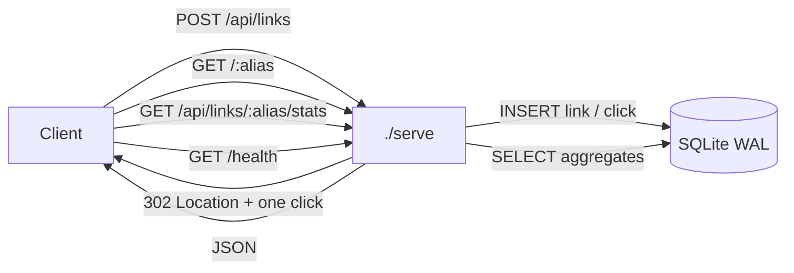

# url-shortener

A self-contained URL shortener with black-box tested analytics, in one executable.

[](https://github.com/Gabrielpl-dev/url-shortener/actions/workflows/ci.yml)


Create short links, redirect visitors, and record each click with its referrer
and user-agent. Aggregated per-link statistics (totals, clicks per day, top
referrers, device mix) are exposed over a small JSON API. Persistence is a single
SQLite file. No external services and no third-party runtime dependencies — the
whole server is Python's standard library.

## Quickstart

Prerequisites: **Python 3.8+** and `bash` (nothing else; there is no `./setup`,
because there are no packages to install).

```bash
./serve --port 8080
```

The process listens on `127.0.0.1:8080` and is ready as soon as `GET /health`
returns `200`:

```bash
curl -s http://127.0.0.1:8080/health
# {"status":"ok"}
```

Configuration (all optional):

| Variable   | Default                  | Effect                             |
|------------|--------------------------|------------------------------------|
| `DATA_DIR` | `./data`                 | Directory holding `shortener.db`   |
| `BASE_URL` | `http://127.0.0.1:<port>`| Prefix used to build `short_url`   |
| `HOST`     | `127.0.0.1`              | Bind address                       |

Stop the server with `Ctrl-C` (SIGINT) or SIGTERM; both shut down gracefully with
exit code `0`.

## API

All responses are JSON objects. Errors are always `{"error":"<code>"}`.

| Method        | Path                        | Success | Notes                                   |
|---------------|-----------------------------|---------|-----------------------------------------|
| `GET`/`HEAD`  | `/health`                   | 200     | `{"status":"ok"}` (HEAD has no body)    |
| `POST`        | `/api/links`                | 201     | Create a link (`url` required, `alias` optional) |
| `GET`         | `/api/links`                | 200     | List all links, newest first            |
| `GET`         | `/api/links/{alias}/stats`  | 200     | Aggregated clicks for one link          |
| `DELETE`      | `/api/links/{alias}`        | 204     | Delete a link and its clicks            |
| `GET`         | `/{alias}`                  | 302     | Redirect and record exactly one click   |
| `HEAD`        | `/{alias}`                  | 302     | Redirect without recording a click      |

### Health

```bash
curl -s http://127.0.0.1:8080/health
```

```json
{"status":"ok"}
```

### Create a link

```bash
curl -s -X POST http://127.0.0.1:8080/api/links \
  -H 'Content-Type: application/json' \
  -d '{"url":"https://example.com/uma/url/longa","alias":"meulink"}'
```

```json
{"alias":"meulink","url":"https://example.com/uma/url/longa","short_url":"http://127.0.0.1:8080/meulink","created_at":"2026-10-07T10:47:40Z","total_clicks":0}
```

Omit `alias` (or send `""`) to have one generated: exactly 7 characters of
`[a-z0-9]`.

### Redirect

```bash
curl -s -i http://127.0.0.1:8080/meulink -H 'Referer: https://news.ycombinator.com/'
```

```http
HTTP/1.1 302 Found
Server: url-shortener/0.1.0
Date: Wed, 07 Oct 2026 10:47:40 GMT
Location: https://example.com/uma/url/longa
Content-Length: 0
```

### Stats

```bash
curl -s http://127.0.0.1:8080/api/links/meulink/stats
```

```json
{"alias":"meulink","url":"https://example.com/uma/url/longa","short_url":"http://127.0.0.1:8080/meulink","created_at":"2026-10-07T10:47:40Z","total_clicks":5,"clicks_by_day":[{"date":"2026-10-07","count":5}],"top_referrers":[{"referrer":"https://news.ycombinator.com/","count":3},{"referrer":"(direct)","count":2}],"devices":{"desktop":0,"mobile":1,"bot":4}}
```

### List links

```bash
curl -s http://127.0.0.1:8080/api/links
```

```json
{"links":[{"alias":"meulink","url":"https://example.com/uma/url/longa","short_url":"http://127.0.0.1:8080/meulink","created_at":"2026-10-07T10:47:40Z","total_clicks":5}]}
```

### Delete a link

```bash
curl -s -i -X DELETE http://127.0.0.1:8080/api/links/meulink
```

```http
HTTP/1.1 204 No Content
Server: url-shortener/0.1.0
Date: Wed, 07 Oct 2026 10:47:40 GMT
Content-Length: 0
```

### Error codes

| Code                 | Status | When                                             |
|----------------------|--------|--------------------------------------------------|
| `invalid_json`       | 400    | Body is not a JSON object (empty, malformed, `[]`) |
| `invalid_url`        | 400    | `url` missing, not a string, or not an absolute http(s) URL ≤ 2048 chars |
| `invalid_alias`      | 400    | `alias` present but not `^[a-z0-9_-]{3,32}$`, or reserved |
| `alias_taken`        | 409    | `alias` already exists                           |
| `payload_too_large`  | 413    | Request body > 8192 bytes                        |
| `not_found`          | 404    | Alias does not exist                             |
| `method_not_allowed` | 405    | Method not supported on an existing route        |
| `route_not_found`    | 404    | Path is not a known route                        |
| `internal_error`     | 500    | Unexpected server-side failure                   |

## Architecture



## Design decisions

- **SQLite with WAL.** A single file, no server to run, and WAL keeps readers
  from blocking the writer. All access goes through one connection guarded by a
  lock, so writes are serialized and a read after a confirmed write always sees
  it.
- **Lowercase aliases with a fixed regex (`^[a-z0-9_-]{3,32}$`).** Case-folding
  and Unicode normalization are entire classes of bugs; a small, strict alphabet
  keeps aliases unambiguous, URL-safe, and trivially shareable. A handful of
  reserved words (`api`, `health`, …) can never collide with internal routes.
- **`missing User-Agent` → `bot`.** An empty UA is overwhelmingly automated
  traffic; classifying it as `bot` keeps the device mix honest instead of
  silently inflating `desktop`.
- **`HEAD` does not count.** Health checkers, link previewers, and crawlers issue
  HEAD requests. Counting only `GET` keeps the numbers tied to actual visits.
- **No auth.** This is a single-tenant demo service; authentication would add
  surface area without changing what the project demonstrates.

## Limitations

- No authentication or authorization; anyone who can reach the port can manage
  links.
- No rate limiting, quotas, link expiry, or password protection.
- No pagination, search, or sorting on `GET /api/links`.
- No IP geolocation and no client-IP storage.
- Device classification is a heuristic over the User-Agent string, not
  fingerprinting.
- Click counting is not exactly-once if the client disconnects mid-response.

## Testing and linting

The black-box acceptance suite (`tests/`) starts a real `./serve` process with a
temporary `DATA_DIR` and only talks to it over HTTP. It uses only the standard
library.

```bash
python3 -m unittest discover -s tests -v   # or: make test
```

Linting uses [ruff](https://docs.astral.sh/ruff/) with the versioned `ruff.toml`:

```bash
ruff check .    # or: make lint
```

CI (`.github/workflows/ci.yml`) runs `lint`, `test`, and a `smoke` job that boots
`./serve` and checks `/health`.

## How this was built

This project was built by an internal autonomous agent harness. The specification
came first. The implementation in this repository was written end-to-end by an
**autonomous AI agent** (no human edited the code). The black-box acceptance
tests used for grading were written by a **different AI agent, independent of the
implementer**, working only from the specification; those tests live outside this
repository and are run by the harness. The tests in `tests/` are the
implementer's own public suite, written to the same contract. The overall flow is
specification → implementation → independent black-box verification.

## License

Released under the [MIT License](LICENSE), © 2026 Gabrielpl-dev.
